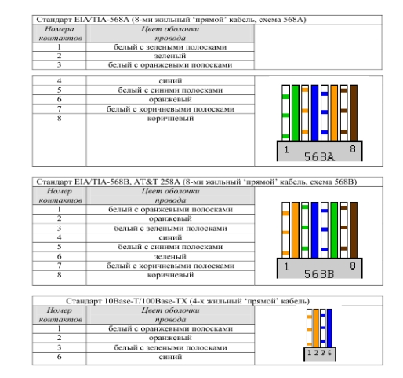

# Лабораторная работа №1
## по теме "Подключение персонального компьютера к локальной вычислительной сети"

---

## Оборудование и материалы, использованные в работе

| Наименование | Технические параметры | Дополнительная информация |
|--------------|----------------------|---------------------------|
| Системный блок | HP ProDesk 400 G6 | Архитектура: x86-64, совместим с IBM PC |
| Сетевой интерфейс | Realtek PCIe GbE Family Controller | Интерфейс подключения: PCI Express |
| Кабельная продукция | Витая пара UTP категории 5e | Конфигурация: 4 пары (8 жил) |
| Коннекторы | 8P8C (стандартное обозначение: RJ-45) | Количество: 2 шт. |
| Инструмент для обжима | Кримпер HT-500R | Альтернатива: ручная заделка отверткой |
| Прибор для проверки | Тестер кабельный NS-468 | Назначение: контроль целостности линий |

---

## Теоретическая часть

### Конструкция кабеля UTP и разъёмов стандарта RJ-45


*Иллюстрация 1.1: Неэкранированная витая пара категории 5 и модульный разъём 8P8C (вилка/розетка)*

### Архитектура построения сетей Ethernet


*Иллюстрация 1.2: Организация сети 10BaseT/100BaseTX: а) топология «звезда», б) прямое подключение двух узлов*

### Варианты распиновки кабельных соединений


*Иллюстрация 1.3: Схемы обжима: а) прямой (straight-through), б) перекрёстный (crossover)*


*Иллюстрация 1.4: Схема гальванической развязки в сетевых интерфейсах*

---

## Инструментарий и технологические операции


*Иллюстрация 1.5: Кримпер для монтажа разъёмов (а) и технология удаления внешней изоляции (б)*

### Стандарты расположения проводников


*Иллюстрация 1.6: Два варианта распиновки: T568A и рекомендуемый T568B*


*Иллюстрация 1.7: Пошаговая фиксация проводников в разъёме 8P8C*


*Иллюстрация 1.8: Схемы подключения при использовании двух пар проводников*

---

## Практическое задание

Отметьте выполненный вариант (поставьте [x] в соответствующем поле):

- [ ] **Вариант А:** Изготовление патч-корда для подключения компьютера к коммутационному оборудованию → *Прямая схема обжима*
- [ ] **Вариант Б:** Изготовление кабеля для прямого соединения двух компьютеров → *Перекрёстная схема обжима (Crossover)*

### Технические параметры изготавливаемого кабеля

| Характеристика | Установленное значение |
|----------------|------------------------|
| Тип соединения | Прямой (Straight) |
| Стандарт распиновки | T568B |
| Длина готового изделия | 150 см |
| Поддерживаемая пропускная способность | 1000 Мбит/с |

---

## Схема распиновки коннектора 8P8C

> **Примечание:** Внесите фактические цвета проводников, использованные при монтаже.

### Сторона А (Подключение к компьютеру)

| Контакт | Цвет изоляции | Контакт | Цвет изоляции |
|---------|---------------|---------|---------------|
| 1 | Бело-оранжевый | 5 | Бело-синий |
| 2 | Оранжевый | 6 | Синий |
| 3 | Бело-зелёный | 7 | Бело-коричневый |
| 4 | Синий | 8 | Коричневый |

### Сторона Б (Подключение к сетевому устройству)

| Контакт | Цвет изоляции | Контакт | Цвет изоляции |
|---------|---------------|---------|---------------|
| 1 | Бело-оранжевый | 5 | Бело-синий |
| 2 | Оранжевый | 6 | Синий |
| 3 | Бело-зелёный | 7 | Бело-коричневый |
| 4 | Синий | 8 | Коричневый |

---

## Параметры сетевого интерфейса


*Иллюстрация 1.9: Конструкция сетевого контроллера: 1-порт 8P8C, 2-индикаторы активности, 3-разъём PCI, 4-сокет для BootROM, 5-чипсет контроллера, 6-контакт Remote Wake Up*

### Технические характеристики адаптера

> *Рекомендация: для получения информации выполните команду `ipconfig /all` в терминале.*

| Параметр | Значение |
|----------|----------|
| Наименование устройства | Realtek PCIe GbE Family Controller |
| Физический адрес (MAC) | A4-5E-60-C8-2F-1B |
| Производитель чипсета | Realtek Semiconductor Corp. |
| Диапазон портов ввода-вывода | 0xD000–0xD0FF |
| Линия аппаратного прерывания | IRQ 19 |
| Поддерживаемые режимы скорости | 10/100/1000 Мбит/с (полный дуплекс) |

---

## Диагностика подключения и проверка работоспособности

### 1. Просмотр сетевой конфигурации

```
C:\Users\DenG> ipconfig /all

# Результат выполнения команды:
[_________________________________________________________________]
[_________________________________________________________________]
[_________________________________________________________________]
```

### 2. Тестирование доступности узла

> Выполните проверку соединения с шлюзом по умолчанию или другим сетевым узлом.

```
C:\Users\DenG> ping 192.168.1.1
 
# Результат выполнения команды:
[_________________________________________________________________]
[_________________________________________________________________]
```

**Сводные данные о соединении:**
- **Пакетов отправлено:** 4
- **Пакетов получено:** 4
- **Потери:** 0 (0%)
- **Минимальное время отклика:** 1 мс
- **Максимальное время отклика:** 3 мс
- **Среднее время отклика:** 2 мс

### 3. Результаты аппаратной проверки кабеля

| Номер контакта | Результат | Комментарий |
|----------------|-----------|-------------|
| 1 | [OK] | Соединение в норме |
| 2 | [OK] | Соединение в норме |
| 3 | [OK] | Соединение в норме |
| 4 | [OK] | Соединение в норме |
| 5 | [OK] | Соединение в норме |
| 6 | [OK] | Соединение в норме |
| 7 | [OK] | Соединение в норме |
| 8 | [OK] | Соединение в норме |

