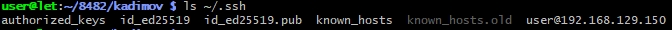
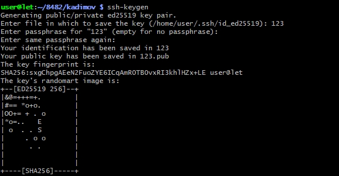
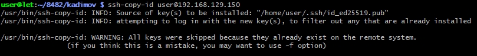

# Лабораторная работа
## По теме "Подключение к Raspberry Pi по протоколу SSH"

##  Цель работы
Научиться подключаться к одноплатному компьютеру Raspberry Pi по SSH с использованием пароля и аутентификации по ключам, а также выполнить базовые операции с файловой системой.

---

##  ЧАСТЬ 1. Подключение по паролю и работа с файловой системой

### 1.1. Установка SSH-соединения
Для подключения к Raspberry Pi выполните команду в терминале:
```bash
ssh user@192.168.129.150
```

---

### 1.2. Создание каталогов и файлов
1. Перейдите в корневой каталог и откройте папку с номером вашей группы.
2. Внутри создайте каталог, названный вашей фамилией.
3. Выполните задание по созданию вложенных каталогов и файлов (согласно варианту/методичке).

Пример команд:
```bash
cd /
cd путь_к_папке_группы
mkdir Фамилия
cd Фамилия


---

### 1.3. Проверка структуры и отключение
Для рекурсивного вывода всей созданной структуры выполните:
```bash
ls -R
```


>  *Вставьте скриншот с результатом выполнения ls -R*

Для завершения сессии SSH используйте команду:
```bash
exit
```


---

##  ЧАСТЬ 2. Настройка подключения по SSH-ключам

### 2.1. Проверка наличия существующих ключей
На **локальном ПК** проверьте директорию `.ssh`:
```bash
ls ~/.ssh
```



Если в выводе присутствуют `id_rsa.pub` или `id_dsa.pub` → ключи уже созданы, генерацию можно пропустить.


---

### 2.2. Генерация новой пары SSH-ключей
Если ключей нет, выполните:
```bash
ssh-keygen
```


- При запросе пути сохранения: нажмите `Enter` (по умолчанию `~/.ssh/`)
- При запросе пароля для защиты приватного ключа: оставьте пустым и нажмите `Enter`


Проверьте результат:
```bash
ls ~/.ssh
```
Должны появиться:
- `id_rsa`  приватный ключ (хранится на ПК)
- `id_rsa.pub`  публичный ключ (копируется на Raspberry Pi)

---

### 2.3. Копирование публичного ключа на Raspberry Pi
Используйте утилиту `ssh-copy-id` для автоматического добавления ключа в `~/.ssh/authorized_keys` на плате:
```bash
ssh-copy-id user@192.168.129.150
```
> При первом подключении будет запрошен пароль пользователя (`123`).



---

## Ответы на контрольные вопросы


## 1. Что такое командная строка?
**Командная строка** (терминал, shell, командный интерпретатор) — это текстовый интерфейс для взаимодействия пользователя с операционной системой. В отличие от графического интерфейса (GUI), где команды выполняются через клики мышью, в командной строке пользователь вводит текстовые команды.

---

## 2. Основные команды управления файлами

| Действие | Linux/Unix | Windows |
|----------|-----------|---------|
| Список файлов | `ls [-la]` | `dir` |
| Смена каталога | `cd путь` | `cd путь` |
| Создать папку | `mkdir имя` | `mkdir имя` |
| Удалить файл | `rm файл` | `del файл` |
| Удалить папку | `rm -r папка` | `rmdir /s папка` |
| Копировать | `cp от куда куда` | `copy от куда куда` |
| Переместить | `mv от куда куда` | `move от куда куда` |
| Просмотр файла | `cat файл` | `type файл` |

---

## 3. Команды вывода информации о системе

| Команда | Описание |
|---------|----------|
| `uname -a` | Информация о ядре и системе |
| `hostname` | Имя хоста |
| `whoami` | Текущий пользователь |
| `date` | Текущая дата и время |
| `uptime` | Время работы системы |
| `free -h` | Информация о памяти |
| `df -h` | Информация о дисковом пространстве |
| `cat /etc/os-release` | Информация о дистрибутиве |
| `lscpu` | Информация о процессоре |
| `ps aux` | Список процессов |
| `top` / `htop` | Мониторинг системы в реальном времени |

---

## 4. Команды ввода/вывода файлов

| Команда | Описание |
|---------|----------|
| `cat file` | Вывод содержимого файла |
| `less file` | Постраничный просмотр файла |
| `more file` | Постраничный просмотр (базовый) |
| `head file` | Первые строки файла |
| `tail file` | Последние строки файла |
| `nano file` / `vim file` | Редактирование файла |
| `echo "text" > file` | Запись текста в файл (перезапись) |
| `echo "text" >> file` | Добавление текста в файл |
| `grep "pattern" file` | Поиск текста в файле |
| `wc file` | Подсчёт строк, слов, символов |

---

## 5. Возможно ли полноценное управление системой только через командную строку?

** Да.** 

**Обоснование:**
- Все системные вызовы доступны через CLI
- Серверы часто работают без графического интерфейса (Headless)
- Скрипты позволяют автоматизировать любые задачи
- Удалённое администрирование (SSH) работает только с CLI
- Аварийное восстановление системы возможно только через консоль


---

## 6. Отличия командной строки Windows от MS-DOS

| Критерий | MS-DOS | Windows CMD |
|----------|--------|-------------|
| Архитектура | 16-бит, однозадачная | 32/64-бит, многозадачная (NT) |
| Файловая система | FAT12/16 | NTFS, FAT32, exFAT |
| Команды | Встроенные в COMMAND.COM | Внешние .exe + API |
| Скриптинг | Простые .bat | .bat, .cmd, PowerShell |
| Сеть | Отсутствует | Полная поддержка TCP/IP |
| Кодировка | ASCII | Unicode |


---

## 7. Интерпретаторы команд в других ОС

| ОС | Интерпретаторы | Особенности |
|----|---------------|-------------|
| Linux | `bash`, `zsh`, `fish` | Скриптинг, автодополнение, плагины |
| macOS | `zsh` (по умолчанию) | Интеграция с Unix-утилитами |
| BSD | `sh`, `tcsh`, `csh` | Стандарты POSIX, безопасность |
| Android | `sh`, `bash` (Termux) | Адаптированные Linux-утилиты |
| Windows | `cmd`, `PowerShell` | Работа с .NET-объектами |
| Сетевое ПО | Cisco IOS, MikroTik CLI | Специализированные команды |

---
